<p align="center">
  
</p>

<h1 align="center">🏠 UrbanShift</h1>

<p align="center">
  <strong>A Modern Real Estate & Relocation Platform</strong><br>
  Buy, Sell, Rent Properties & Book Packers-Movers — All in One Place!
</p>

<p align="center">
  <a href="https://urbanshift.vercel.app">🌐 Live Demo</a> •
  <a href="#features">✨ Features</a> •
  <a href="#tech-stack">🛠️ Tech Stack</a> •
  <a href="#screenshots">📸 Screenshots</a> •
  <a href="#installation">� Installation</a>
</p>

---

## � Overview

**UrbanShift** is a full-stack real estate platform that connects property buyers, sellers, and renters. It also offers integrated **Packers & Movers** services for seamless relocation. Built with modern technologies for a smooth, responsive experience across all devices.

---

## ✨ Features

### � Property Management

- 📝 List properties for **Rent** or **Sale**
- 🖼️ Multi-image upload with **automatic compression** (Cloudinary)
- � Advanced property search & filters
- ❤️ Wishlist / Favorite properties
- 📱 Mobile-responsive property gallery with swipe gestures

### � User System

- 🔐 **JWT Authentication** (Login/Register)
- 🌐 **Google OAuth** (Continue with Google)
- 📧 **Email Verification** via OTP (Brevo)
- � Forgot/Reset Password
- � User Profile with avatar upload
- ✅ Seller Verification by Admin

### � Dashboards

- 🏪 **Seller Dashboard** — Manage listings, track leads
- 🛒 **User Dashboard** — View purchases & bookings
- 🚚 **Company Dashboard** — Manage relocation requests
- 👑 **Admin Panel** — Verify users, manage properties (Jazzmin UI)

### � Packers & Movers

- 📦 Book relocation services
- 💬 Real-time **Chat** with service providers
- 📄 Digital **Receipts** & booking history
- 💳 **Razorpay Payments** integration
- 🎉 Beautiful success animations (Confetti!)

### � User Experience

- � **Dark/Light/System Theme** toggle
- ⚡ Splash screen with animations
- 📲 **PWA Ready** — Installable on mobile
- 🔔 Toast notifications
- 📊 Vercel Speed Insights

---

## 🛠️ Tech Stack

### Frontend

| Technology         | Purpose       |
| ------------------ | ------------- |
| **React 19**       | UI Framework  |
| **React Router 7** | Navigation    |
| **Axios**          | API Calls     |
| **TailwindCSS**    | Styling       |
| **React Icons**    | Icons         |
| **React Toastify** | Notifications |
| **Firebase**       | Google Auth   |
| **Vercel**         | Hosting       |

### Backend

| Technology                | Purpose          |
| ------------------------- | ---------------- |
| **Django 6**              | Web Framework    |
| **Django REST Framework** | REST API         |
| **Django Channels**       | WebSocket (Chat) |
| **Simple JWT**            | Authentication   |
| **Cloudinary**            | Image Storage    |
| **PostgreSQL**            | Database         |
| **Brevo (Sendinblue)**    | Email Service    |
| **Razorpay**              | Payments         |
| **Render**                | Hosting          |

---

## 📸 Screenshots

> **📌 Add the following screenshots to showcase your app:**

### 1. Home Page

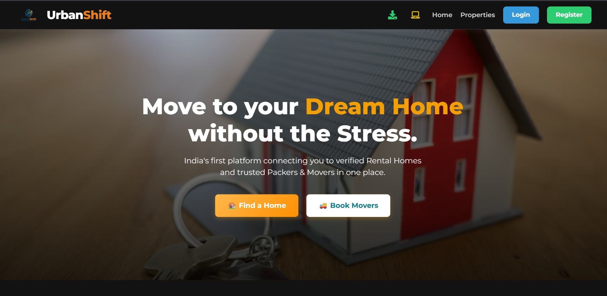
_Hero section with property search and featured listings_

### 2. Property Listing

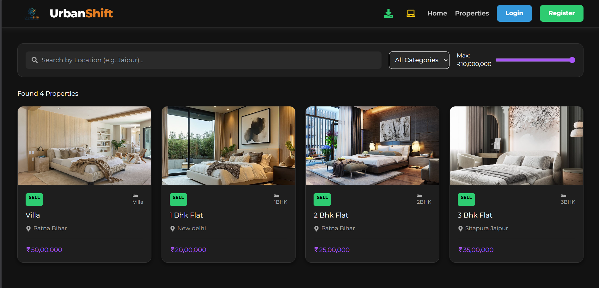
_Browse all properties with filters_

### 3. Property Details

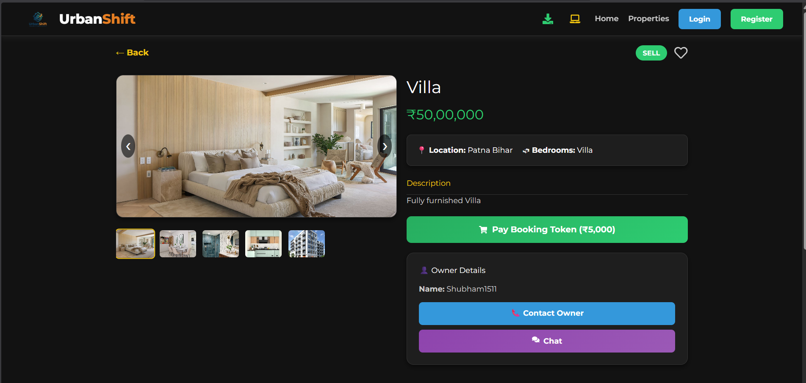
_Detailed view with image gallery, seller info, and contact options_

### 4. Seller & Company Dashboards

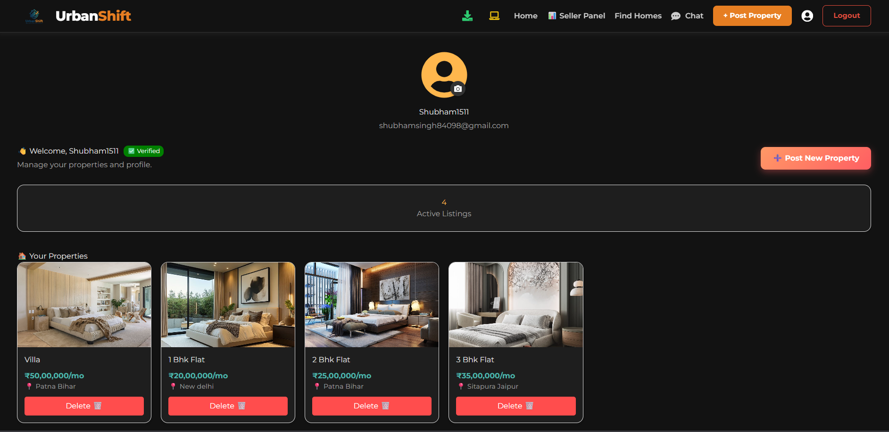
_Manage your property listings_

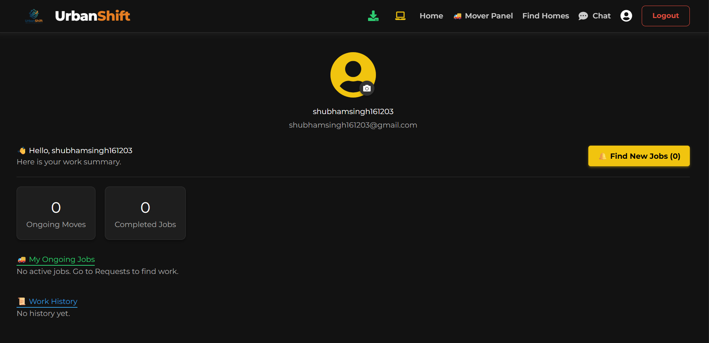
_Manage relocation requests (Packers & Movers)_

### 5. Packers & Movers

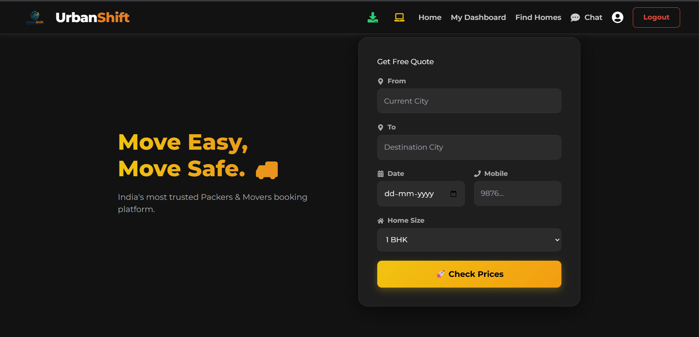
_Book relocation services_

### 6. Real-time Chat

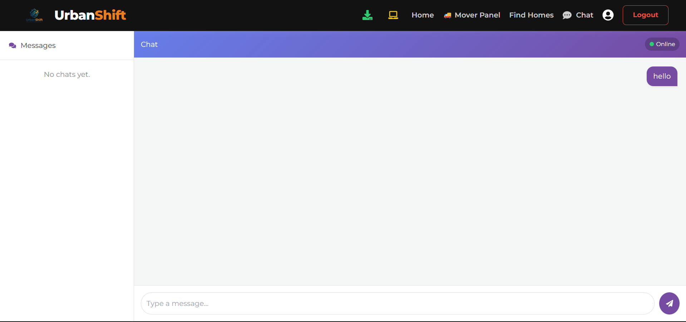
_Chat with property owners or service providers_

### 7. Payment Flow

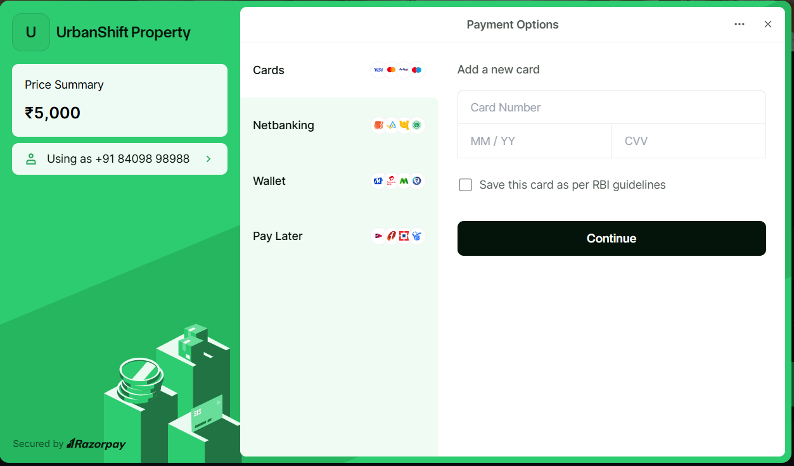
_Razorpay payment integration_

### 8. Dark & Light Mode

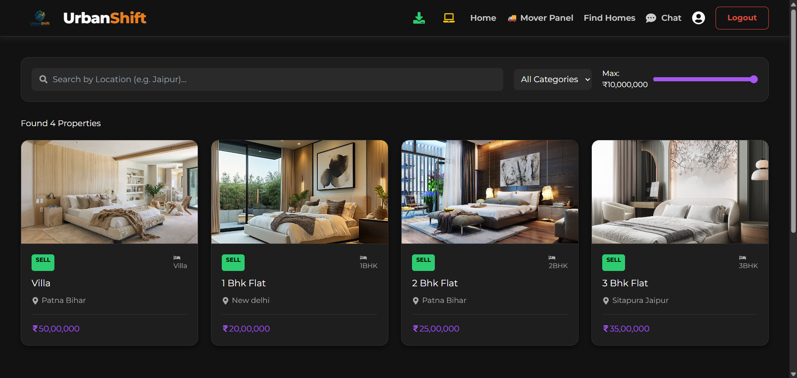
_Dark Theme_

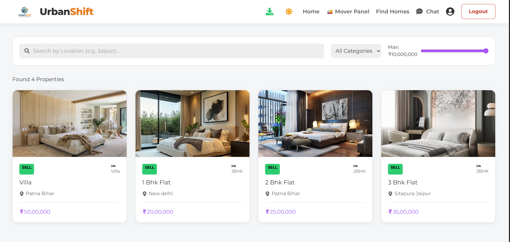
_Light Theme_

### 9. Mobile View

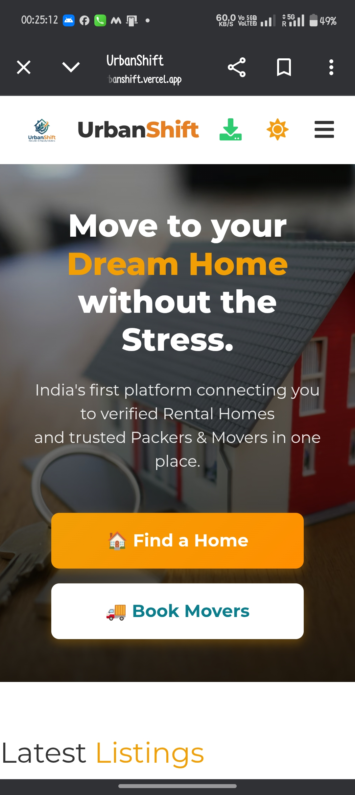
_Fully responsive mobile experience_

---

## � Installation

### Prerequisites

- Node.js 18+
- Python 3.10+
- PostgreSQL (or use SQLite for development)

### Frontend Setup

```bash
cd frontend
npm install
npm start
```

### Backend Setup

```bash
cd backend
python -m venv venv
source venv/bin/activate  # On Windows: venv\Scripts\activate
pip install -r requirements.txt
python manage.py migrate
python manage.py runserver
```

### Environment Variables

Create `.env` files in both `frontend` and `backend` directories:

**Backend `.env`:**

```env
SECRET_KEY=your-django-secret-key
DEBUG=False
DATABASE_URL=your-postgresql-url
CLOUDINARY_CLOUD_NAME=your-cloud-name
CLOUDINARY_API_KEY=your-api-key
CLOUDINARY_API_SECRET=your-api-secret
BREVO_API_KEY=your-brevo-key
RAZORPAY_KEY_ID=your-razorpay-key
RAZORPAY_KEY_SECRET=your-razorpay-secret
```

---

## � Project Structure

```
UrbanShift/
├── frontend/                 # React Frontend
│   ├── public/
│   │   ├── urbanshift-logo.png
│   │   └── manifest.json
│   └── src/
│       ├── components/       # UI Components
│       ├── context/          # Theme Context
│       └── App.js
│
├── backend/                  # Django Backend
│   ├── backend/              # Settings & URLs
│   ├── users/                # User Auth & Profiles
│   ├── properties/           # Property CRUD
│   ├── relocation/           # Packers & Movers
│   ├── chat/                 # WebSocket Chat
│   ├── payments/             # Razorpay Integration
│   └── requirements.txt
│
└── README.md
```

---

## 👨‍💻 Author

**Shubham Singh**

- GitHub: [@shubbhamsingh](https://github.com/shubbhamsingh)
- Project Link: [UrbanShift](https://github.com/shubbhamsingh/UrbanShift-Project)

---

## 📄 License

This project is licensed under the MIT License.

---

<p align="center">
  Made with ❤️ in India 🇮🇳
</p>
